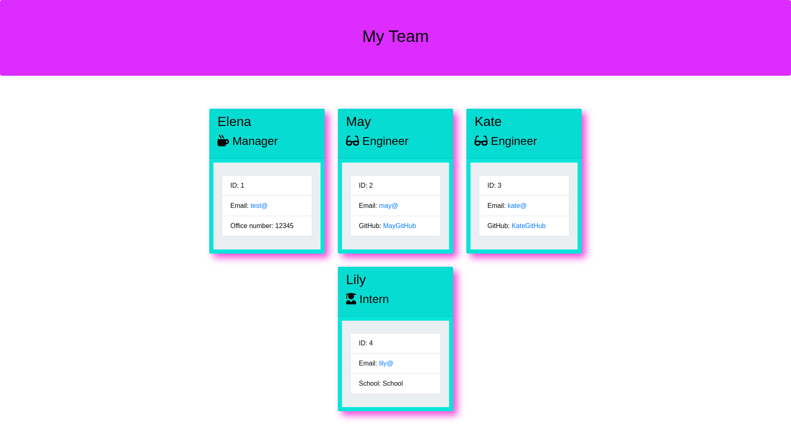

# Team_Profile_Generator_EDementieva

  

## Description

The task in this Challenge is to convert the given starter code into a working Node.js command-line application. This application takes in information about employees on a software engineering team, then generates an HTML webpage that displays summaries for each person. The tests provided make sure that every part of the code passes each test.

## Installation

Use git clone to clone this project onto your local machine. To install necessary dependencies, run the following command: npm install

## Usage of the application:

When a user starts the application, they're prompted to enter the team manager's:

    Name

    Employee ID

    Email address

    Office number

When a user enters those requirements, the user is presented with a menu with the option to:

    Add an engineer

    Add an intern

    Finish building the team

When a user selects the engineer option, the user is prompted to enter the following and then taken back to the menu:

    Engineer's Name

    ID

    Email

    GitHub username

When a user selects the intern option, the user is prompted to enter the following and then taken back to the menu:

    Intern’s name

    ID

    Email

    School

When a user decides to finish building their team, they exit the application and the HTML is generated.

## Credits

The questions used to gather information about the development team members are based on the demo shown by the instructor Dan Mueller in class on 24.02.2023.

## License

MIT License